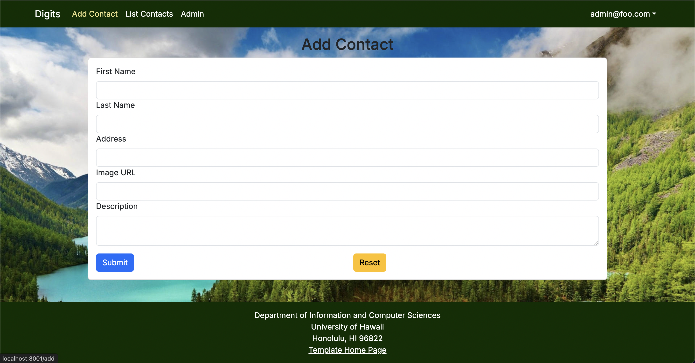

# digits

digits is a contact management application that allows users to:

- Create and maintain a list of contacts
- Add timestamped notes to contacts
- Manage contact details including images

## Installation

First, install PostgreSQL and create a digits database:

```
$ createdb digits
```

Second, clone the repository:

```
$ git clone https://github.com/anayaemily/digits
```

Third, cd into the app directory and install dependencies:

```
$ cd digits
$ npm install
```

Fourth, create a `.env` file and set up your database URL.

Finally, initialize the database:

```
$ npx prisma migrate dev
$ npx prisma db seed
```

## Usage

The application includes the following pages:

### Landing Page


The landing page shows what the application is about and allows you to sign in or sign up in the top right of the navbar.

### List Contacts


The list contacts page displays the contacts you have added, or the contacts you have access to view. You can add timestamped notes to each contact, as well as edit the contact details.

### Add Contacts


The list contacts page allows you to add a new contact to the database.

### Admin Page


The list contacts page displays all of the contacts of the database, and who added them (when signed into an admin account).
